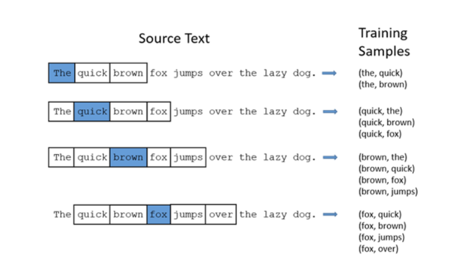
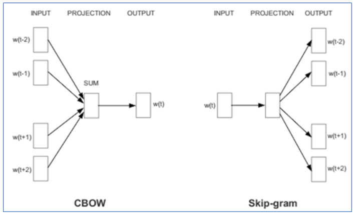

# Word2vec Pytorch

Fast word2vec implementation at competitive speed compared with fasttext. The slowest part is the python data loader. Indeed, Python isn't the fastest programming language, maybe you can improve the code :)

## Advantages

* Easy to understand, solid code
* Easy to extend for new experiments
* You can try advanced learning optimizers, with new learning technics
* GPU support

## Supported features

* Skip-gram
* Batch update
* Cosine Annealing
* Negative Sampling
* Sub-sampling of frequent word

## Tutorial

CBOW & Skip-gram;

1. **Skip-gram**: Given a set of sentences (corpus) the model loops on the words of each sentence and either tires to use the current word in order to predict its neighbors (i.e., its context).
2. **CBOW**: use each of these contexts to predict the current word. (Continuous Bag of Words)
3. To limited the number of words in each context, "**window size**" is used.

Word2vec does so in one of the two ways aforementioned. Typically, the skip-gram produces more accurate results on large datasets.

When the feature vector assigned to a word cannot be used to accurately predict that word’s context, the components of the vector are adjusted. Each word’s context in the corpus is the teacher sending error signals back to adjust the feature vector. The vectors of words judged similar by their context are nudged closer together by adjusting the numbers in the vector.

## Model Overview

